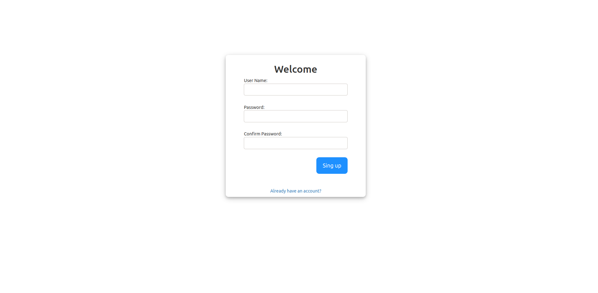
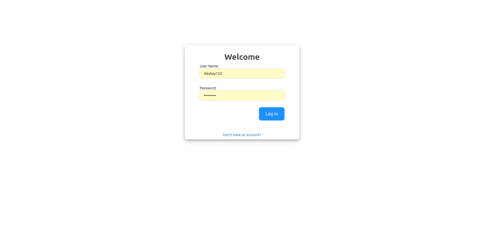
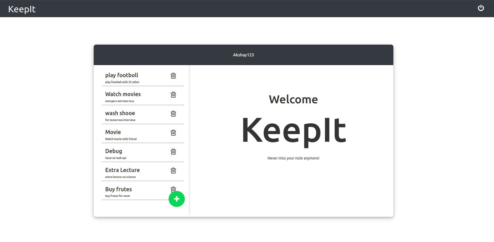
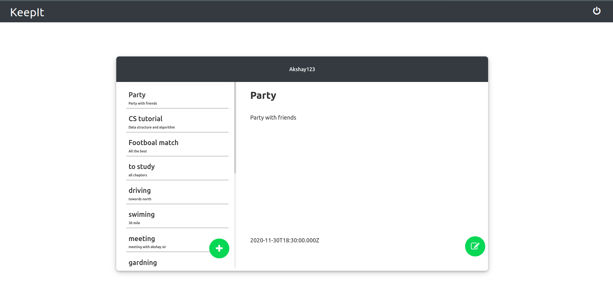
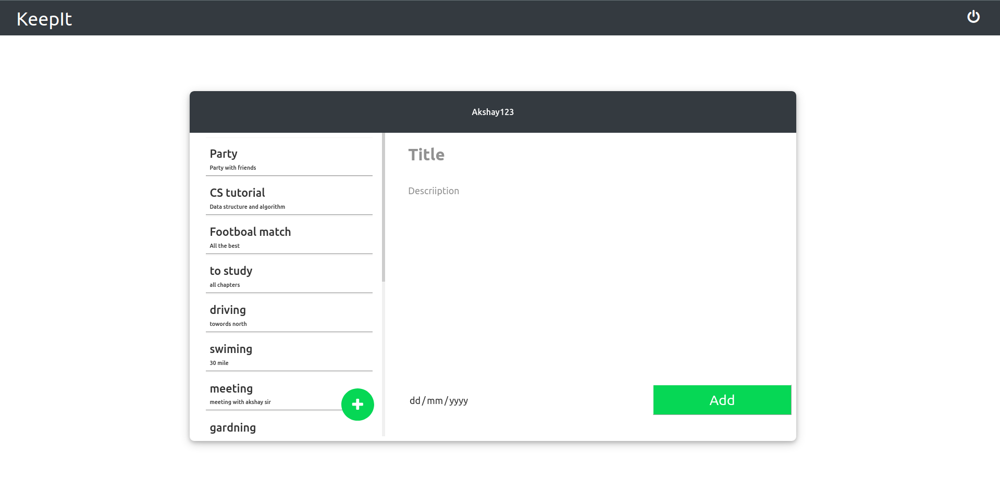

# Exercise-Traker

Exercise-Traker allow users to track there dally exercise

### Dependencies used
* Express
* bcrypt
* cors
* mongoose
* nodemon
* body-parser

### Install Dependencies
    npm install

### Run Server
    cd Server
    npm start

### Run React Application
    cd Exercise-traker
    npm start

### Images

#### Signup UI

#### Login UI

#### Dashboard UI

#### Exercise UI

#### Add Exercise UI
