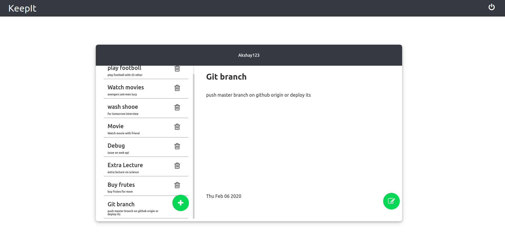

# Exercise-Traker

This is Exercise-Traker project in MERN stack using the following technologies:
* [React](https://reactjs.org/) and [React Router](https://www.npmjs.com/package/react-router) from frontend
* [Express](https://expressjs.com/) and [Mongoose](https://mongoosejs.com/) for backend
* [SASS](https://sass-lang.com/) for styling
* [Webpack](https://webpack.js.org/) for compilation

### Dependencies used
* Express
* Express-Session
* uuid
* bcrypt
* cors
* mongoose
* nodemon
* body-parser

### Install Dependencies
Inside server folder type following code

    cd server
    npm install --save

### Run Server
    cd Server
    npm start

### Run React Application
    cd Exercise-traker
    npm start --save

### Images

#### Signup UI

#### Login UI

#### Dashboard UI

#### Exercise UI

#### Add Exercise UI
